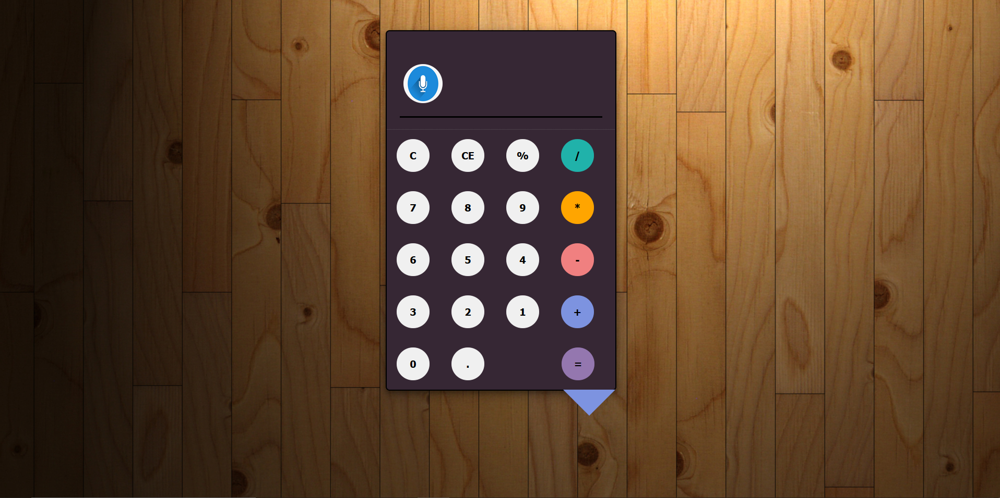
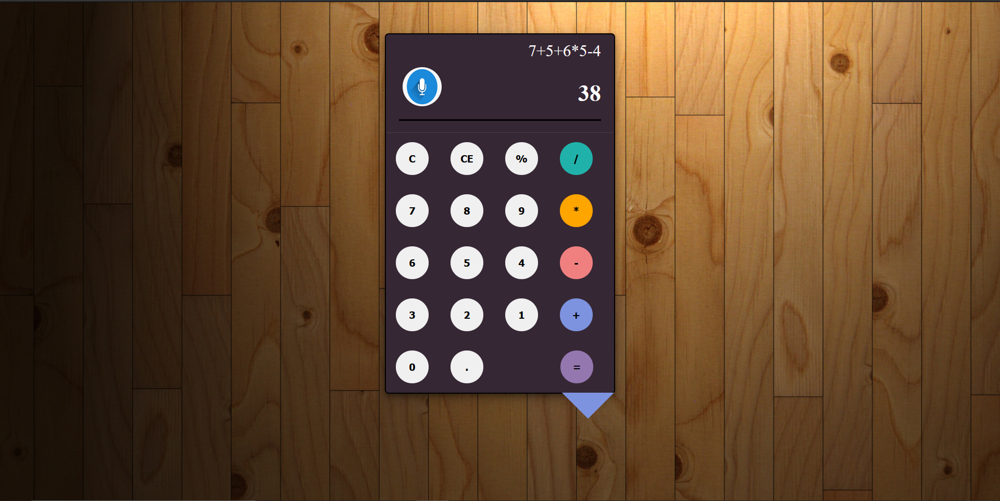

# Web Calculator
The application is live at: https://jorawarsinghsaini.github.io/calculator/
## ui design

## with 2 inputs:

## with multiple inputs:
 
 
 The web calculator performs all the operations that the physical calculator does. It additionaly includes handling of edge cases which can reduce hassle of user and also help them to arrive at correct results as early as possible. It also has a voice command functionality which can save a lot of time and gives a high-tech look to the calculator.
 
 Various Edges cases have been handled such as:
 
 * If multiple '.' are  typed by mistake then it preserves the previous number as well as   alerts the user about the mistake.
 * If the equation contains operator at last without the last operand, then the system alerts out the user. Eg. 2+ and equal to operator will alert the user.
 * If operators consecutively occuring then it alerts for it. Eg. 2+* will result in 2* and user will be alerted about the mistake.
 
 
Steps for voice commands.

*    Open in Google Chrome.
*    Click on Google Voice Button next to Calendar Header.
*    Allow Permission for audio.
*    Say something like "7+6-4+3-2"
*    Done. The result is outputed at the calculator screen. 
